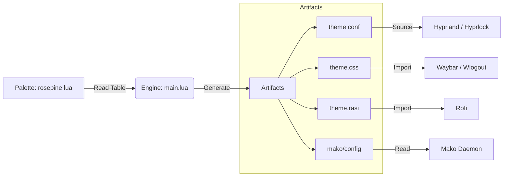

# ⚙️ The Theme Engine

The heart of Celestial Shade is `theme/main.lua`. Unlike traditional configs that rely on hardcoding colors or using `sed` to replace text, this engine acts as a **Compiler**.

## Architecture

The system follows a **Single Source of Truth (SSOT)** philosophy.

1.  **Input:** A Lua table defining the palette (e.g., `theme/palettes/rosepine.lua`).
2.  **Process:** The Engine maps these variables to specific syntax requirements for different apps.
3.  **Output:** Static "Artifact" files that applications read.

### Data Flow



## The Generator Logic

The engine contains specific generator functions for each file format.

**Example: CSS Generator**
It takes the Lua table and formats it into GTK standard CSS variables.
```lua
function Gen.css(t)
    local content = string.format([[
@define-color bg_base #%s;
@define-color primary #%s;
@define-color error #%s;
]], t.base, t.primary, t.error)
    Utils.write_file(artifact_dir .. "/theme.css", content)
end

This ensures that `theme.css` is always valid CSS, and `theme.conf` is always valid Hyprlang, eliminating syntax errors during theme switches.
---

